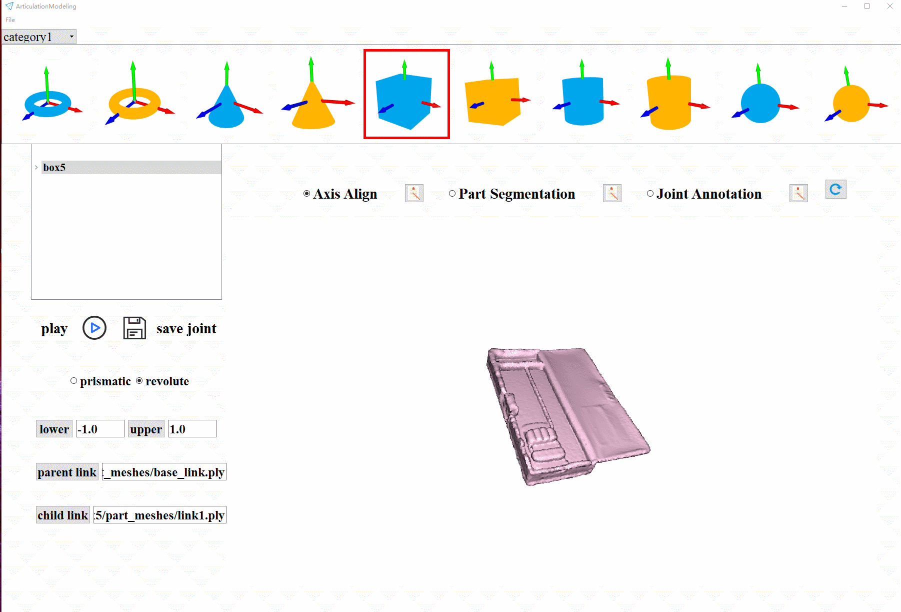

# LabelArticulation

LabelArticulation is an interactive articulated object modeling tool that implements:

- Align origin and axis of raw scanned point cloud
- Interactive part segmentation
- Joint annotation (joint location and direction)
- URDF file export

We also support rigid and articulated object 6D pose labeling from captured RGB-D images



## Requirements
- Numpy
- [Open3D](http://www.open3d.org/)>=0.10.0
- [OpenCV](https://opencv.org/)
- PyQt5
- pillow

## Installation

```
$ pip install -r requirements.txt
```

## Update

- 4/2021: Add rigid and articulated object 6D pose labeling tools

## License

LabelArticulation is released under the [MIT license](LICENSE).

## Citing LabelArticulation

If you use LabelArticulation in your research to build dataset, please use the following BibTeX entry.

```
@misc{LabelArticulation2021,
  author =       {Liu Liu and Han Xue and Wenqiang Xu},
  title =        {LabelArticulation},
  howpublished = {\url{https://github.com/liuliu66/LabelArticulation}},
  year =         {2021}
}
```

## Articulation object modeling

After installation, please see [`Tutorial (articulation modeling)`](examples/articulation_modeling/README.md)
for brief tutorials on how to model the raw scanned point cloud into articulation.

## 6D pose annotation

please see [`Tutorial (articulation pose label)`](examples/articulation_pose_label/README.md)
for brief tutorials on how to label 6D pose of articulated objects.

## How to get RGB and depth image?
We strongly recommend to follow [pyrs](https://github.com/Toraudonn/pyrs) repository.
Images of directory "data/" were captured using that repository.

## ToDo

- [x] output a total transformation matrix
- [x] add input arguments (model name, scene name)
- [x] add input argument of initial pose
- [x] add part-level 6D pose annotation
- [x] add prismatic and revolute joint annotation
- [x] add function to choose various models
- [ ] visualize depth data of input scene
- [x] visualize coordinate axis
- [x] realsense to capture rgbd images
- [ ] annotate point cloud and mesh at the same time