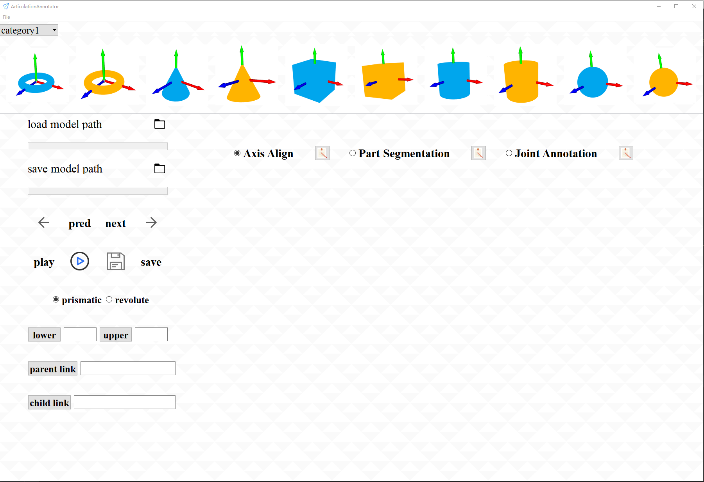
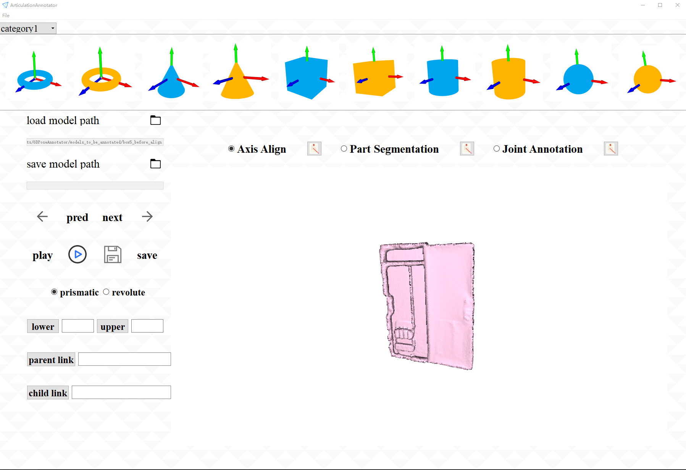
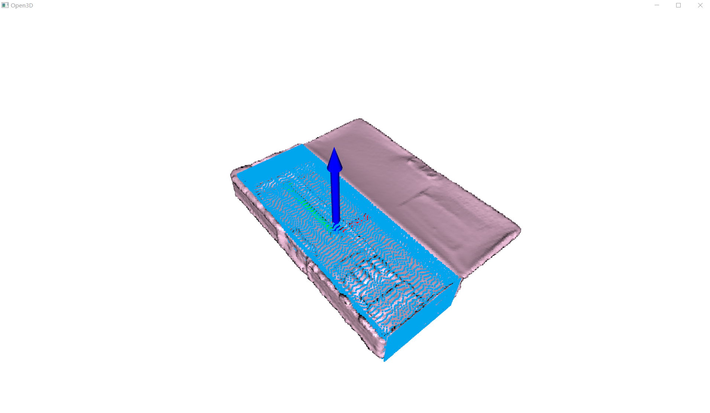
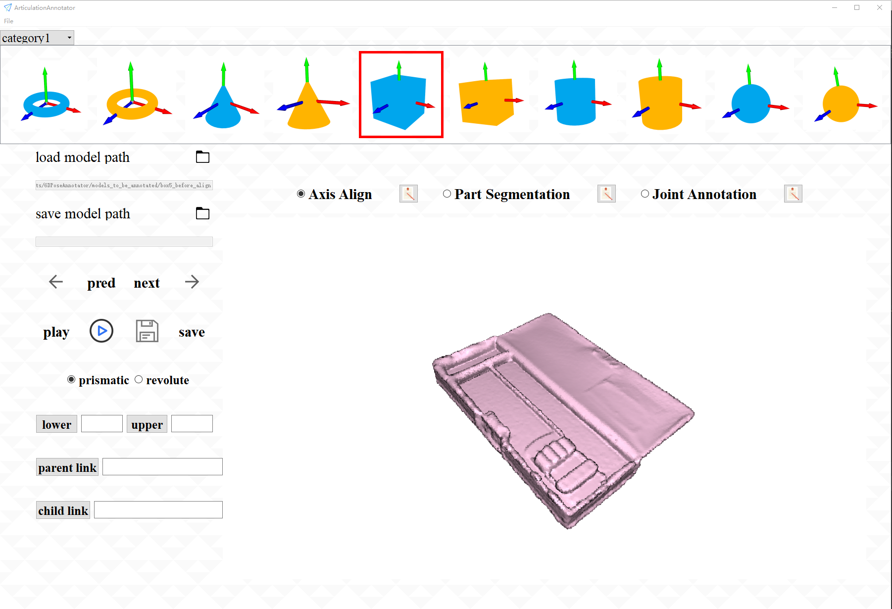
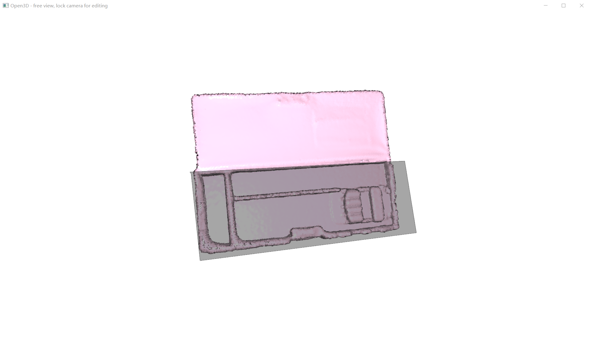
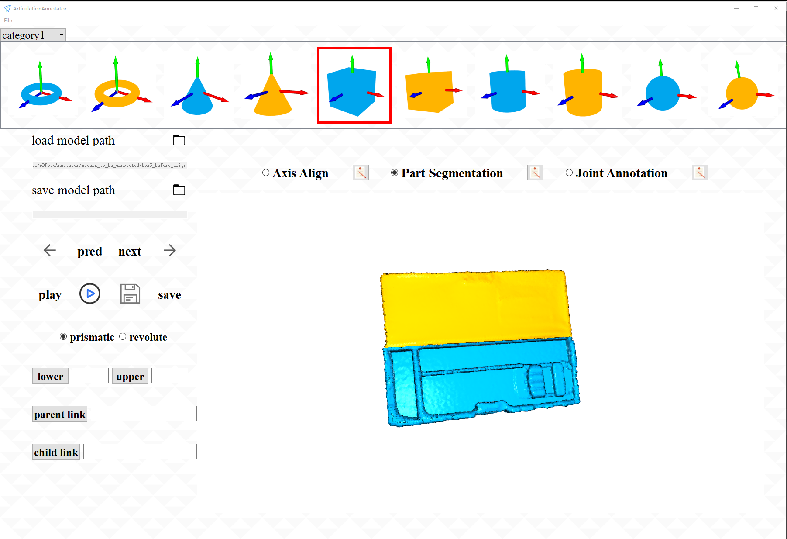
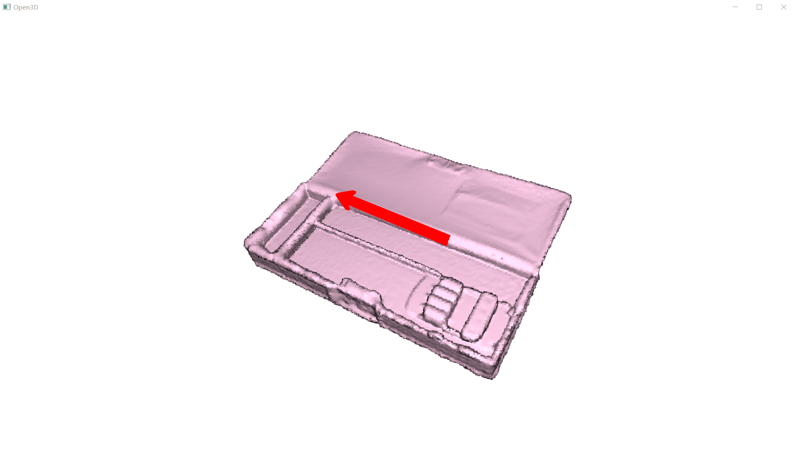
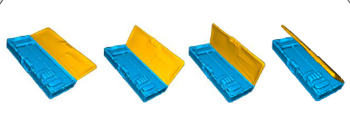
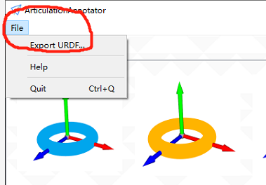

# Articulation Object Modeling Example

## Usage: 
```
$ python articulation_modeling.py
```
gui window




step:

1. "File" - "Import ..." select the directory of model (to be annotated)



2. Select annotation materials from the top of surface

3. Click axis align, first click a point that you think as origin, 
then use keyboard to fine-tune the material's location and rotation



after axis align



4. Click part segmentation, press "k" to fix view point and draw polygon to segment the parts, 
save them in the directory "part_meshes"



after part segmentation



5. Click joint annotation, first click a point that you think as joint's location, 
then input the joint information, joint type (prismatic or revolute), joint limit lower and upper, 
joint parent part, joint child part



click "play animation" you can see a video to help joint verification,
next click "save joint", you can see the articulation tree in the left of surface



6. "File" - "Export URDF..." you can export the annotation to a URDF file.


