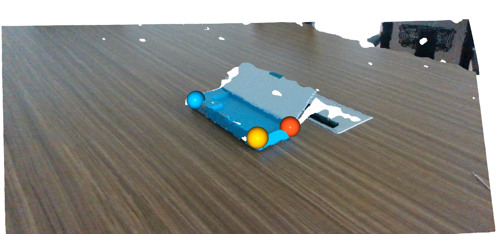

# Articulation Object 6D Pose Annotation Example

we provide two ways to label the articulated object 6D pose: (1) label pose 
per part separately; (2) label pose for base part 
and then label the moving part by joint info

We strongly encourage second way to label articulated object pose. 
Here we provide step-by-step tutorial in this way.

## Preparations

### Data to be labeled

- color images (.jpg file)
- depth images (.png file)
- camera intrinsics (default in realsense json file)

### Articulated object models

- per part point cloud (.ply file)
- per part mesh (.obj file)
- urdf metas that contains urdf infos for articulated object

## Label base part:

### run the script for base part labeling
```
$ python basepart_label.py
```

revise the file to give correct data and model path.


### select three corresponding points for coarse alignment




then typq "q" and wait for a while, you can see alignment result.
if the the model is almost coincided with image point cloud, labeling is
well completed and 4x4 transformation matrix (6D pose) is saved in "data/trans0.json"

### (optional) refine the labeled 6D pose

if you find the model cannot be perfectly aligned with image point cloud, 
we provide to further refine the 6D pose.

```
$ python basepart_refine.py
```

revise the file to give correct data and model path.


you can use the following keyboard hotkeys to manually refine the pose

- "1" and "2" - Rotation around roll axis.
- "3" and "4" - Rotation around pitch axis.
- "5" and "6" - Rotation around yaw axis.
- "w" and "s" - Translation along x axis.
- "a" and "d" - Translation along y axis.
- "e" and "c" - Translation along z axis.
- "f" - Pose refinement by ICP algorithm.
- "-" - save refined pose

When you type "-", the refined 4x4 transformation matrix will be overwrited in "data/trans0.json"

### label moving part by joint info

```
$ python movingpart_label.py
```

revise the file to give correct data and model path.

you can see the moving part is set to be rest state of the articulated object.


then you can use extra hotkeys to label the moving part by its joint info

- "7" and "8" - Translation along prismatic joint.
- "9" and "0" - Rotation along revolute joint.


When you type "-", the 6D poses of base part and moving part are also saved in "data/trans0.json".


